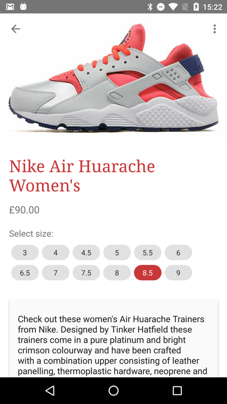

# ChipCloud

ChipCloud is a UI element (very) quickly created as part of a larger hackathon project, it creates a wrapping cloud of Material Design '[Chips](https://www.google.com/design/spec/components/chips.html)' (see screenshot below). This project is not actively maintained.

## Usage

Add to your Android layout xml:
```xml
<eu.fiskur.chipcloud.ChipCloud
    android:id="@+id/chip_cloud"
    android:layout_width="match_parent"
    android:layout_height="wrap_content"/>
```

Then add your items:
```java
ChipCloud chipCloud = new ChipCloud(context);

chipCloud.setup(Color.parseColor("#ff00cc"), new eu.fiskur.chipcloud.ChipListener() {
    @Override
    public void chipSelected(Object object) {
        //...
    }
});

chipCloud.addObject("foo", fooObject);
chipCloud.addObject("bar!", barObject);
```

##Dependency

Add jitpack.io to your root build.gradle, eg:

```groovy
allprojects {
    repositories {
        jcenter()
        maven { url "https://jitpack.io" }
    }
}
```

then add the dependency to your project build.gradle:

```groovy
dependencies {
    compile fileTree(dir: 'libs', include: ['*.jar'])
    compile 'com.github.fiskurgit:ChipCloud:1.0'
}
```
You can find the latest version in the releases tab above: https://github.com/fiskurgit/ChipCloud/releases

More options at jitpack.io: https://jitpack.io/#fiskurgit/ChipCloud

#Licence

Full licence here: https://github.com/fiskurgit/ChipCloud/blob/master/LICENSE.md

In short:

> The MIT License is a permissive license that is short and to the point. It lets people do anything they want with your code as long as they provide attribution back to you and don’t hold you liable.



